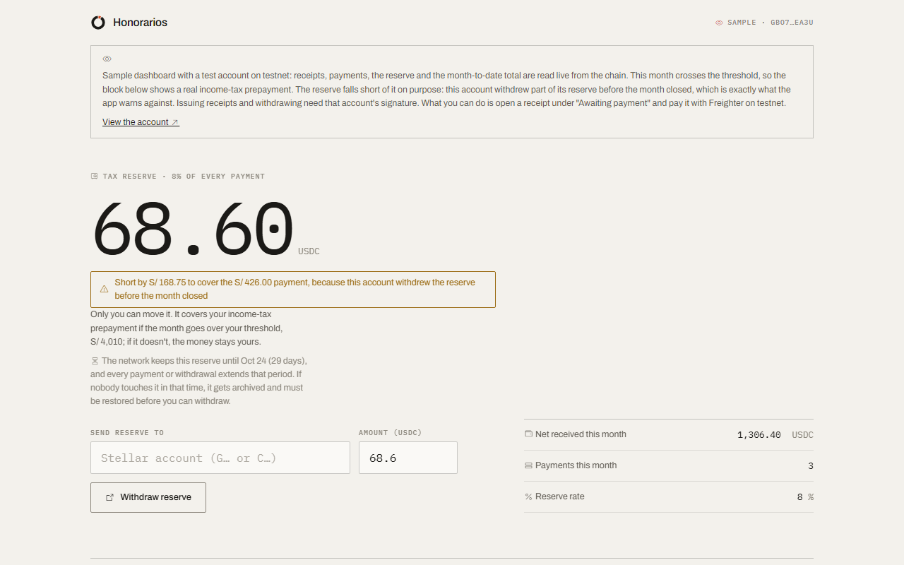
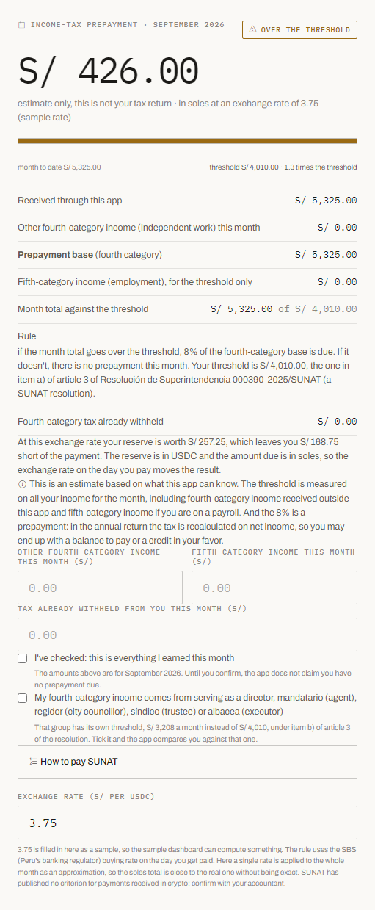
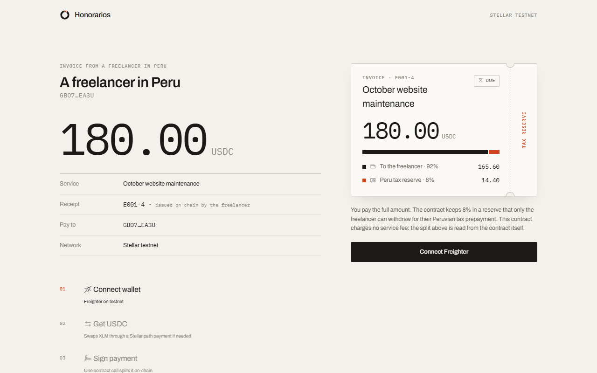
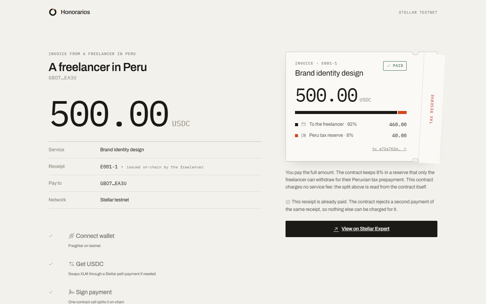
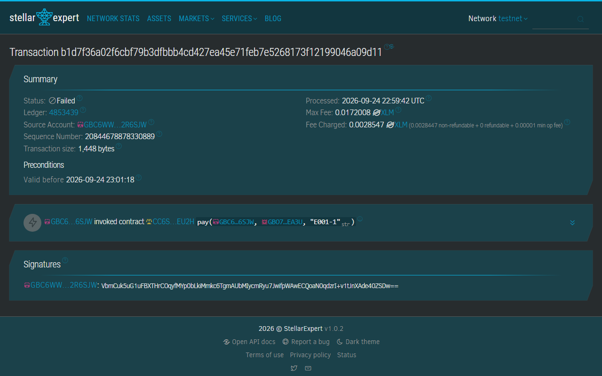

<p></p>

# Honorarios

Honorarios is for freelancers in Peru who are paid by clients abroad. Peru taxes a self-employed professional's fees as "fourth-category income" (rentas de cuarta categoría), and in any month where that income passes a threshold, the freelancer owes SUNAT, Peru's tax authority, a monthly income-tax prepayment (pago a cuenta) of 8% of what they were paid. A client in Peru that acts as a withholding agent takes that amount out of the payment. A client abroad does not, so nobody holds anything back and the freelancer has to set the money aside and pay it on their own.

Honorarios sets aside that 8% at the moment each payment arrives. The freelancer issues a receipt in the app and sends the client a payment link. When the client pays in USDC on Stellar, a smart contract splits the payment in the same transaction: 92% goes to the freelancer's wallet and 8% stays in a reserve in the contract that only the freelancer can withdraw. When the prepayment is due, the money is there.

**Video (2:47):** https://youtu.be/1-1JU7rlbZ0 · **App:** https://honorarios-stellar.vercel.app · **Sample dashboard, no wallet or install needed:** https://honorarios-stellar.vercel.app/?demo · **Network:** Stellar testnet

The sample dashboard reads a test account live from the chain. As of September 24 it had received 1,420 USDC this month (S/ 5,325 at the sample exchange rate of 3.75). The dashboard shows the prepayment that amount triggers, S/ 426, the reserve the account has to cover it, and a pending receipt you can open and pay. The figures change if someone pays that receipt.

## The problem

An example: a designer in Arequipa bills a Madrid agency US$ 1,500 a month. At an exchange rate of 3.75 that is about S/ 5,625 (S/ is the Peruvian sol), above the monthly threshold of S/ 4,010, so that month she has to prepay SUNAT 8% of what she was paid, S/ 450. Nobody withholds it, because her client is abroad, and she has to make the payment herself (article 86 of the TUO de la LIR, the consolidated text of Peru's income tax law; the threshold is the one in article 3.a of [R.S. 000390-2025/SUNAT](https://www.sunat.gob.pe/legislacion/superin/2025/000390-2025.pdf), a SUNAT resolution, with a copy in `evidence/`). What usually happens is that by the due date that money is already spent, because it arrived mixed in with the rest of the payment.

## The solution

The freelancer issues a receipt in the app and sends the link to the client. When the client pays, a contract on Stellar splits the money on the spot: 92% reaches the freelancer's wallet and 8% stays reserved in their name inside the contract, ready for the prepayment.

1. The freelancer creates a wallet with the fingerprint or Face ID of their phone or computer. There is no seed phrase to store and no network fees to pay.
2. They fill in the amount, receipt number and description, and sign the receipt. The receipt is recorded in the contract and the app gives them the payment link.
3. The client opens the link, sees the receipt exactly as it is on chain, and pays that amount once. If the client has no USDC, the app buys it with XLM along the way.
4. The contract splits 92/8 in that same transaction and marks the receipt as paid.
5. The dashboard shows what was collected in the month, works out whether the threshold was crossed (S/ 4,010 in the general case, or S/ 3,208 for the roles listed in article 33 b) of the income tax law: director, síndico (bankruptcy trustee), mandatario (agent under a mandate), gestor de negocios (business manager), albacea (executor) or regidor (municipal councillor)), estimates the prepayment, explains how to pay it to SUNAT (Formulario Virtual 616, SUNAT's online payment form, in soles) and drafts the recibo por honorarios, the electronic fee receipt, so it can be copied into SUNAT.

**Only the freelancer can move their reserve.** The contract has no administrator and no upgrade function, and a withdrawal requires the owner's signature: nobody else, us included, can touch that money. The app does not keep keys on any server either.

Crypto payment links already exist. What Honorarios adds is what happens inside the payment: the 8% reserve, the recorded receipt and the SUNAT threshold.

## How it looks

| Sample dashboard: a month that crosses the threshold | Prepayment estimate in soles |
|---|---|
|  |  |

| What the client sees: amount and description read from the receipt on chain | The same link after payment: the contract refuses a second payment |
|---|---|
|  |  |

And this is how one of the rejected attacks looks in Stellar Expert, the second payment of receipt E001-1:



## How your client abroad pays you

Today, on testnet, with a Stellar wallet in their browser (Freighter) and USDC or XLM. If they only have XLM, the app builds a path payment that buys the missing USDC in the same operation. A client who has never used crypto first needs a way to turn their dollars into USDC on Stellar. This app does not solve that piece, and it is on the list of open items.

## From the reserve to SUNAT, in soles

SUNAT takes payment in soles. On mainnet that is the job of an anchor that pays out soles through SEP-24. The dashboard reads the `stellar.toml` of Anclap ("Sol Digital", PEN) live and shows it in step 1 of "How to pay SUNAT". That anchor runs on mainnet, so from testnet you cannot withdraw to a Peruvian bank.

What does run on testnet is the same path with SDF's test anchor, which accepts Circle's USDC and simulates the payout to a bank (no real soles and no real bank). With an account connected through Freighter, step 1 runs the whole withdrawal:

1. The wallet identifies itself to the anchor by signing its challenge (SEP-10).
2. The anchor opens its withdrawal form (SEP-24) and the freelancer enters their details there.
3. The freelancer signs twice: once to withdraw the reserve from the contract to their account, and once to send the USDC to the anchor with the memo the anchor asked for.
4. The dashboard follows the anchor's status until it marks the withdrawal as completed.

Test run with 5 USDC (the test anchor accepts 1 to 10 per withdrawal): reserve withdrawal [`fe83e290…c7a2`](https://stellar.expert/explorer/testnet/tx/fe83e290085b5f1e2968f3b1c1022c351ec9f30ae2ec5a4c6b5b73745e3fc7a2) and transfer to the anchor [`27244891…183f`](https://stellar.expert/explorer/testnet/tx/27244891bc19085f61e83d70d008a597966d533260e3e481eeb6eeb699b6183f). The script is `web/e2e/sep24.mjs`. A passkey wallet would need the anchor's authentication for contract accounts (SEP-45), which is not wired up.

## How it uses Stellar

| Piece | What for |
|---|---|
| **Soroban** (`split` contract) | Receipts issued by the freelancer, 92/8 split, per-freelancer reserve, withdrawal authorization, `Issued`, `Paid` and `TaxWithdrawn` events |
| **Circle USDC** through the Stellar Asset Contract | Payment currency |
| **Path payments** (`path_payment_strict_receive`) | The client can pay even with only XLM |
| **OpenZeppelin smart accounts + passkeys** (secp256r1, `smart-account-kit`) | Freelancer wallet with no seed phrase |
| **SDF relayer** (OpenZeppelin Channels) | Sponsors the smart wallet's network fees |
| **SEP-10 and SEP-24** with SDF's test anchor | Reserve withdrawal to a simulated bank, end to end on testnet |
| **RPC `getEvents` and `getLedgerEntries`** | The dashboard rebuilds receipts and payments from the chain, with no database, and reads how long the reserve entry has left to live |

## Compliance controls

The asset here is the payment that arrives from abroad, a cross-border remittance. What backs it is the recibo por honorarios, which lives in the contract with its state: issued by the freelancer and paid once. The legal control is the fourth-category income tax prepayment. Each row says where the rule is enforced. When the rule lives in the contract, the network applies it and nobody can skip it from the app.

| Control | How it is enforced | Where |
|---|---|---|
| No payment without a reserve | 8% of the gross is set aside in the same transaction as the payment. There is no payment path that skips it | [`lib.rs:229`](contracts/split/src/lib.rs#L229), rate in `TAX_BPS` ([`lib.rs:10`](contracts/split/src/lib.rs#L10)) |
| Rounding favors the reserve | The 8% rounds up and the fee rounds down | [`lib.rs:228`](contracts/split/src/lib.rs#L228), test `the_reserve_rounds_up` |
| Only what the freelancer issued can be paid | Issuing a receipt requires the freelancer's signature, and `pay` rejects a number nobody issued | [`lib.rs:163`](contracts/split/src/lib.rs#L163) and [`lib.rs:212`](contracts/split/src/lib.rs#L212), tests `issue_requires_the_freelancer_signature` and `rejects_paying_a_receipt_nobody_issued` |
| The receipt sets the amount | The client does not say how much to pay: the contract charges the recorded amount. Editing the link changes nothing | test `pay_reads_the_amount_from_the_receipt` |
| A receipt is paid once | A second payment of the same number is rejected, and a number cannot be reissued with a different amount | [`lib.rs:213`](contracts/split/src/lib.rs#L213) and [`lib.rs:180`](contracts/split/src/lib.rs#L180), tests `a_receipt_cannot_be_paid_twice` and `rejects_issuing_the_same_receipt_twice` |
| No outsider can inflate the month | Since only the freelancer issues receipts, a stranger cannot add payments to their monthly total | test `a_stranger_cannot_issue_receipts_in_someone_elses_name` |
| Only the owner withdraws their reserve | A withdrawal requires the freelancer's signature. A third party signing for themselves is rejected | [`lib.rs:286`](contracts/split/src/lib.rs#L286), tests `withdraw_requires_the_freelancer_signature` and `a_third_party_cannot_withdraw_someone_elses_reserve` |
| No withdrawing more than was reserved | The contract rejects a withdrawal larger than the balance | [`lib.rs:292`](contracts/split/src/lib.rs#L292), test `cannot_withdraw_more_than_reserve` |
| The tax month is Lima's | The monthly total closes at midnight Lima time. UTC month boundaries are not used | `period_of` in [`lib.rs:56`](contracts/split/src/lib.rs#L56), test `the_month_closes_at_midnight_in_lima` |
| Thresholds quoted from the source | S/ 4,010 a month in the general regime and S/ 3,208 for clause b), with their annual caps, copied from article 3 of R.S. 000390-2025/SUNAT instead of derived. The app links the resolution on screen | [`tax.ts:26`](web/src/tax.ts#L26) |
| The fee is capped and never touches the reserve | It is set at deployment. The constructor rejects anything above 1% | [`lib.rs:137`](contracts/split/src/lib.rs#L137), tests `rejects_a_fee_above_the_cap` and `the_tax_reserve_is_never_touched_by_the_fee` |
| Receipt draft | The app drafts the recibo por honorarios to copy into SUNAT Operaciones en Línea, SUNAT's online services portal. It does not issue or send anything to SUNAT | [`rhe.ts`](web/src/rhe.ts) |

Authorizations are tested with the environment in strict mode and no signature granted (`set_auths(&[])`). What the contract cannot see, income collected outside the app, the dashboard asks for by hand: see [Known limits](#known-limits).

## Try it yourself: five attacks the network rejected

These were actually submitted to testnet against the current contract. Each one shows up in Stellar Expert as a failed transaction, with the call and its arguments visible. The error comes from the RPC's diagnostic events.

| Attempt | Transaction | Error |
|---|---|---|
| A third party tries to withdraw the freelancer's reserve by signing for themselves | [`a70d2e8e…304b`](https://stellar.expert/explorer/testnet/tx/a70d2e8e8dad1ea2573208f8fea826acb8e759c0402049e1000af6e9d514304b) | `Error(Auth, InvalidAction)` |
| The freelancer tries to withdraw one unit more than the reserve | [`89aae18f…2cd5`](https://stellar.expert/explorer/testnet/tx/89aae18f5b3db2e482e0f91aee7658be74aac53c2f16a3c00c595cd2b55a2cd5) | `Error(Contract, #2)`, insufficient reserve |
| A stranger issues a 5,000 USDC receipt in the freelancer's name to inflate their month | [`9d636f0a…379f`](https://stellar.expert/explorer/testnet/tx/9d636f0af561a53da8def42db43154d4f175a773c5fa33a403a402f6c818379f) | `Error(Auth, InvalidAction)` |
| The client tries to pay a receipt nobody issued | [`8b15a204…70b6`](https://stellar.expert/explorer/testnet/tx/8b15a2041c9a63c83a8c53a591b6987870858e5d112030bef19de521c8b970b6) | `Error(Contract, #7)`, unknown receipt |
| The client tries to pay the same receipt twice | [`b1d7f36a…9d11`](https://stellar.expert/explorer/testnet/tx/b1d7f36a02f6cbf79b3dfbbb4cd427ea45e71feb7e5268173f12199046a09d11) | `Error(Contract, #8)`, already paid |

To repeat them, with two testnet accounts in `web/.env.development.local` (see `web/.env.example`):

```sh
cd web
node scripts/seed-demo.mjs    # valid receipts, payments and one withdrawal
node scripts/rejections.mjs   # the five attacks; prints the hash, status and error of each one
```

## On-chain evidence (testnet)

**Current contract**, with receipts on chain: [`CC6SGVMYAN3NY7PHFACMA4H4BZSOK2Q2NJ7Z64UJY3PTA4A2TJZOEU2H`](https://stellar.expert/explorer/testnet/contract/CC6SGVMYAN3NY7PHFACMA4H4BZSOK2Q2NJ7Z64UJY3PTA4A2TJZOEU2H), deployed in [`274dbd9d…ee01`](https://stellar.expert/explorer/testnet/tx/274dbd9d24ffd27589edb3199d419a3d396071732ffe8c0fe40ee8e96727ee01).

| What | Link |
|---|---|
| Receipt E001-1 issued by the freelancer, 500 USDC | [`03661e88…6e0d`](https://stellar.expert/explorer/testnet/tx/03661e88d5e2ef3d08a054e6491d13994c2b819ab65fcfa390d3e8a78d216e0d) |
| Payment of E001-1: 460 to the freelancer, 40 to the reserve | [`a72e762d…7d2e`](https://stellar.expert/explorer/testnet/tx/a72e762d37e6ec2870384f4a847b7d8a4cf266ba72cf3c5a3cf33b8a13647d2e) |
| Withdrawal of 40 USDC from the reserve | [`12a8b7b2…d2d7`](https://stellar.expert/explorer/testnet/tx/12a8b7b2ebfceddf08c5cc8f411b761ad59d1569c50c9d03ffe3f2143c92d2d7) |
| Receipt issued with a passkey from a smart wallet | [`bc6bec92…8139`](https://stellar.expert/explorer/testnet/tx/bc6bec92cfd900db2947833f5eaa417e3a31808e6051188d2e8c12239fd78139) |
| Payment of that receipt and withdrawal signed with a passkey | [`e22cf150…dc0f`](https://stellar.expert/explorer/testnet/tx/e22cf150b6e72be964b28d74a601eeb46563038145c69ed6a61bfad4c489dc0f), [`b8b6e02d…074d`](https://stellar.expert/explorer/testnet/tx/b8b6e02dcedd1a86ebf651b633ca530df390c35eea3c1312d5b1d7f9ddb5074d) |

The sample dashboard account is [`GBO7CDLI4L2AW4UQNFP5Z4KTUDHKP2K3P4EPU6VGCYCFD7IMCO3KEA3U`](https://stellar.expert/explorer/testnet/account/GBO7CDLI4L2AW4UQNFP5Z4KTUDHKP2K3P4EPU6VGCYCFD7IMCO3KEA3U). As of September 24 it had three paid receipts this month (500, 620 and 300 USDC: 1,420 USDC, S/ 5,325 at the sample rate of 3.75, with a prepayment of S/ 426) and one pending, E001-4 for 180 USDC. Its reserve is 68.60 USDC, or S/ 257.25, after 45 USDC were withdrawn (40 to its own account and 5 through the test anchor). Its reserve falls short of the prepayment because part of it was withdrawn before the month closed, which is exactly what the app warns against. The full list of hashes is in [`evidence/2026-09-24-contract/source.md`](evidence/2026-09-24-contract/source.md).

Testnet USDC (Circle): `USDC:GBBD47IF6LWK7P7MDEVSCWR7DPUWV3NY3DTQEVFL4NAT4AQH3ZLLFLA5`, SAC `CBIELTK6YBZJU5UP2WWQEUCYKLPU6AUNZ2BQ4WWFEIE3USCIHMXQDAMA`.

## Architecture

Component diagram, payment flow and withdrawal flow: [docs/architecture.md](docs/architecture.md).

```
contracts/split/   Soroban contract (Rust) and its 31 tests
web/               frontend (Vite + TypeScript): pay.html and the dashboard
web/src/tax.ts     prepayment estimate, kept apart from the interface, with its tests
web/scripts/       sample dashboard seed, rejected attacks and check-demo
web/e2e/           Playwright scripts that run the flow on testnet and record it
docs/              architecture, business model and screenshots
evidence/          primary sources and deployment evidence
```

## Contract

| Function | Authorized by | What it does |
|---|---|---|
| `issue(freelancer, receipt_ref, gross, concept)` | `freelancer` | Records the receipt with its amount and description. A number can be issued once. `Issued` event |
| `receipt(freelancer, receipt_ref)` | read only | The receipt: amount, description and whether it has been paid |
| `pay(payer, freelancer, receipt_ref)` | `payer` | Charges the receipt amount: 8% to the reserve, the service fee if there is one, the rest to the freelancer. Marks the receipt as paid. `Paid` event |
| `fee()` | read only | The service fee the contract was deployed with, and where it goes |
| `tax_reserve(freelancer)` | read only | Reserved balance |
| `month_gross(freelancer, period)` | read only | Gross collected in a month, to compare against the threshold |
| `current_period()` | read only | Tax period of the current ledger |
| `withdraw_tax(freelancer, to, amount)` | `freelancer` | Moves the reserve, `TaxWithdrawn` event |
| `extend_reserve(freelancer)` | nobody (anyone can call it) | Renews the reserve's TTL without moving funds. The dashboard offers it when 10 days or fewer are left |

Errors: `InvalidAmount` (1), `InsufficientReserve` (2), `InvalidParty` (3), `ReceiptRefTooLong` (4), `FeeTooHigh` (5), `ReceiptExists` (6), `UnknownReceipt` (7), `AlreadyPaid` (8), `ConceptTooLong` (9) and `EmptyReceiptRef` (10). The reserve, the receipt and the monthly total renew their TTL on every operation that touches them.

## How to run it

Contract:

```sh
rustup target add wasm32v1-none
cargo test
stellar contract build
stellar contract deploy --wasm target/wasm32v1-none/release/split.wasm \
  --source-account <account> --network testnet -- \
  --token CBIELTK6YBZJU5UP2WWQEUCYKLPU6AUNZ2BQ4WWFEIE3USCIHMXQDAMA \
  --fee_bps 0 --fee_to <account that would receive the fee>
```

Frontend:

```sh
cd web && npm install && npm run dev
npm test     # 31 tests: prepayment estimate and payment split
```

The payment link uses the domain set in `VITE_PUBLIC_BASE` (see `web/.env.example`) instead of the machine that generates it, because the person who opens it is a client abroad.

Testnet walkthrough scripts, with no assertions: they are for recording and for checking by eye that the full flow still works. They use a development signer that only exists under `npm run dev` and reads testnet keys from `web/.env.development.local` (kept out of the repo):

```sh
node web/e2e/record.mjs    # signed receipt and payment with Freighter
node web/e2e/passkey.mjs   # passkey with a virtual WebAuthn authenticator: wallet, receipt, payment and withdrawal
node web/e2e/demo.mjs      # full walkthrough, recorded in one take for the video
node web/e2e/sep24.mjs     # reserve withdrawal through SDF's test anchor
```

`node scripts/check-demo.mjs`, run from `web/` and also in CI, checks that the sample dashboard account has payments in the current contract. It exists because a redeployment once left that constant pointing at a dead contract, and the dashboard showed zeros until someone opened it.

## Business model

**0.5% per settled payment, with no monthly fee.** Under the assumptions in [docs/business.md](docs/business.md), Peru alone yields between US$ 10,500 and US$ 67,000 a year. That is a one-person business, and we say so. The larger case is that a prepayment with no withholding agent is the same problem in Mexico, Colombia and Argentina, which have an order of magnitude more freelancers paid in dollars. The Stellar rail stays the same from country to country; what gets rewritten is the contract and the regulation it cites. Peru is the wedge.

The contract can charge that fee. It comes out of the gross alongside the net and the reserve, it has a hard cap of 1% that the constructor refuses to exceed, the `Paid` event publishes how much was charged, and the payment page reads it with `fee()` and shows it itemized before the client signs. The fee never touches the 8% reserve.

**This contract is deployed with the fee set to zero.** The 0.5% is an unvalidated proposal: we have not done a single pricing interview. The contract is MIT licensed.

## What already exists

Setting aside a percentage for tax at the moment of payment has been done before. In the United States, [Found](https://found.com/taxes) and Lili do it by splitting each deposit as it arrives, and [Qapital](https://www.qapital.com/blog/qapital-freelancer-rule-taxes/) has offered it as a rule since 2015. Found also pays the quarterly estimates to the IRS from inside the app, which is exactly the piece missing here. In crypto, payment-splitting contracts that send a share to a second address have run on EVM chains for years, and on Stellar there are splitting and payroll projects for freelancers.

What we did not find is the Peruvian part: the 8% rate and the tax month that closes at midnight Lima time inside the contract, the four thresholds from article 3 of the resolution quoted by number instead of derived from the UIT (Peru's tax reference unit), the case of article 33 clause b) with its own threshold, and the recibo por honorarios recorded before payment. That is localization of a known mechanism, and it is worth saying plainly: the mechanism is solved elsewhere, and what this project contributes is grounding it in a specific regulation, with the source in view.

## What this project has not solved

- **The client needs USDC or XLM in a Stellar wallet.** The on-ramp for dollars from someone who has never used crypto is not solved.
- **Turning pricing on requires deploying another contract.** `fee_bps` is set in the constructor and there is no setter, no admin and no upgrade. Live reserves and the monthly total stay in the old contract, so a price change splits each user's state in two, right in the number that is compared against the threshold. The sensible alternative would be an adjustable fee with the same 1% cap, a waiting period before it applies and an event that announces it. It is not implemented.
- **Holding third-party funds has regulatory consequences in Peru.** Managing virtual assets makes the provider a reporting entity before the UIF (Unidad de Inteligencia Financiera, Peru's financial intelligence unit). An immutable contract that only the owner can withdraw from is a defensible argument that there is no discretionary custody here. It is still only an argument; we have not done a legal analysis.
- **Zero pricing interviews.** The 0.5% comes from comparing with what a payment processor charges. We have not asked anyone.

## Known limits

- Testnet only. According to their own READMEs, `smart-account-kit` and the relayer have no independent audit. Fees are free for as long as SDF's public testnet relayer is.
- **The threshold is measured on all of your income for the month, including income that never passes through this app.** The contract can only add up its own payments, so the dashboard asks by hand for other fourth-category income, fifth-category (employment) income and withholdings already made. With those fields empty, the number it shows comes out low. The withholdings field has no bound: a mistyped number lowers the estimated payment.
- The 8% is a prepayment. The final tax is recalculated on net income in the annual return, and there can be a balance owed or a credit. The app does not do that calculation.
- The 8% reserve is precautionary: if the month does not cross the threshold there is no prepayment, and the freelancer can withdraw it once the month closes.
- We did not find a SUNAT rule specific to fees paid in crypto. The exchange rate used to measure the threshold is entered by the freelancer, and the app applies a single rate to the whole month.
- The app does not issue electronic receipts. The receipt recorded by the contract is the app's own, and SUNAT's is copied from the draft into SUNAT Operaciones en Línea. The draft does not include the minimum amount above which a Peruvian agent withholds: we have not verified it.
- The detail of each payment and the list of pending receipts are rebuilt from RPC events, which testnet keeps for about a week. The monthly figures, the reserve and the status of each receipt live in the contract and do not expire. After that window the dashboard says so, and the draft for an old payment can no longer be generated.
- The tax logic is isolated in `web/src/tax.ts`, and the split shown before signing is tested in `web/src/split.test.ts`: 31 tests in total, plus the contract's 31, all in CI. The rest of the frontend has no automated tests: the files in `web/e2e/` are walkthrough scripts with no assertions.
- In this deployment, the account that would receive the fee is the test account that deployed the contract. With the fee at zero it never receives anything.
- The reserve is an organizing aid and does not replace advice from an accountant.

## License

[MIT](LICENSE)
