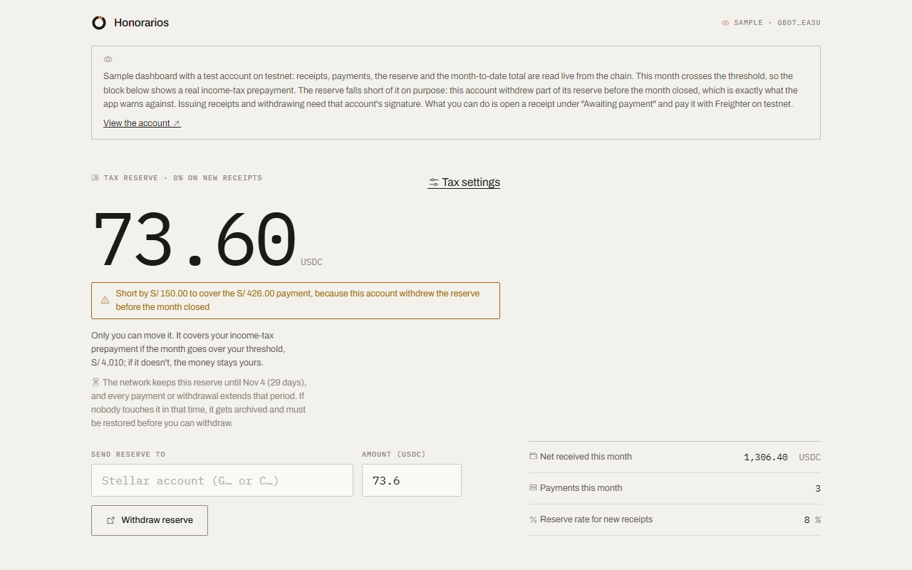
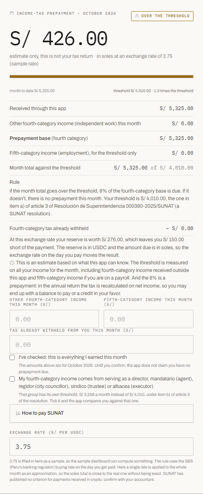
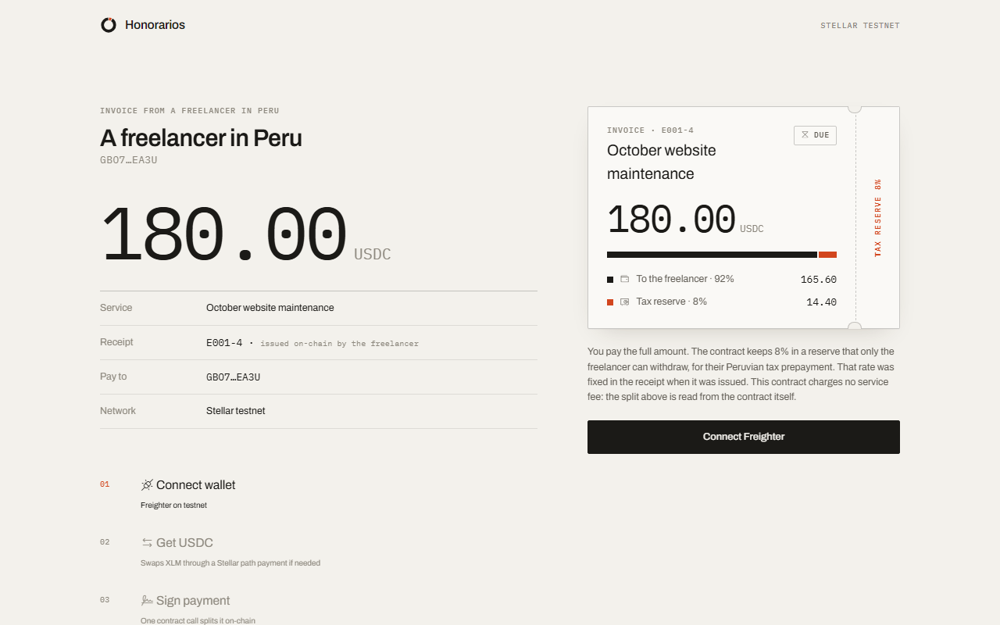
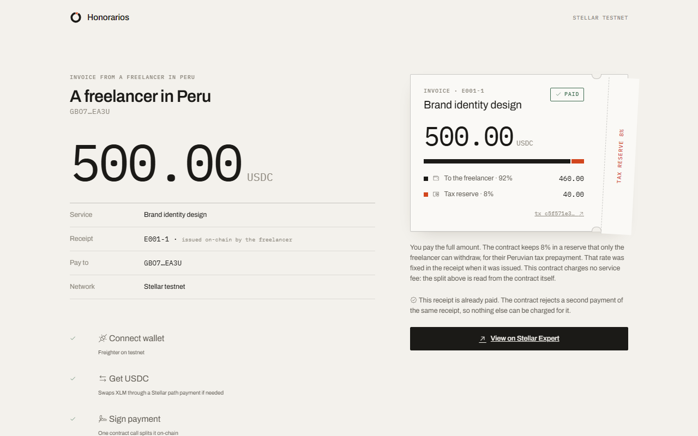
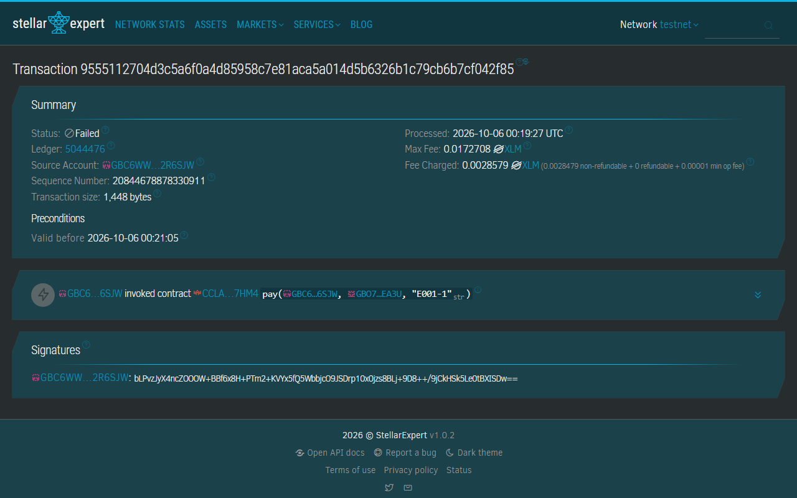

<p></p>

# Honorarios

A freelancer paid by a client abroad receives the full amount of every invoice. In many countries a local client would withhold part of it for the tax authority. A foreign client has no such duty, so nobody holds anything back. The tax prepayment comes due weeks or months later, and by then the money has often been spent, because it arrived mixed in with everything else.

Honorarios sets that money aside at the moment the payment arrives. The freelancer chooses what share of each payment to reserve and in which time zone their tax month closes. They issue a receipt in the app and send the client a payment link. When the client pays in USDC on Stellar, a smart contract splits the payment in the same transaction: the net goes to the freelancer's wallet and the reserve stays in the contract, in their name, where only they can withdraw it.

Peru is the first fully supported country, with its 8% rate, its SUNAT threshold and the tax month closed on Lima time, all cited from the source. For any other country the freelancer picks their own percentage and the app makes no claim about their law.

**Video (1:58):** https://youtu.be/Mtt03zllCic · **App:** https://honorarios-stellar.vercel.app · **Sample dashboard, no wallet or install needed:** https://honorarios-stellar.vercel.app/?demo · **Network:** Stellar testnet

## Verify it in 2 minutes

<a id="contract-id"></a>**Contract (testnet):** [`CCLAMGX6EACGRA3D3FSFARER7V4KZUFY54M52AZ4UDXPVR47GVRE7HM4`](https://stellar.expert/explorer/testnet/contract/CCLAMGX6EACGRA3D3FSFARER7V4KZUFY54M52AZ4UDXPVR47GVRE7HM4)

This is the only place in this README where the contract ID appears. Every other section links back here.

**Also on mainnet:** the same verified wasm runs as [`CBXE3Z56…CLQ4`](https://stellar.expert/explorer/public/contract/CBXE3Z563JXVWEQ6LA5OV2JBRFVDIWNGXDQC77AUWMIDWU25CDW4CLQ4). One real payment of 2 USDC was split 1.84 / 0.16 in a single transaction: [`929c4cbc…7d98`](https://stellar.expert/explorer/public/tx/929c4cbc3b0101e095162aa7d5d21b633531e14a1482e040a73d1613dd127d98). The builder paid himself; it proves the contract on mainnet, not traction. Details in [`evidence/2026-10-06-mainnet/source.md`](evidence/2026-10-06-mainnet/source.md).

1. A freelancer saves the Peru preset on chain (800 basis points, UTC-5): [`3290d413…5e63`](https://stellar.expert/explorer/testnet/tx/3290d413d201b3a337e5f6fbd065cc53ed64b91514fa6ba45ea0e526429c5e63)
2. A client pays receipt E001-1 for 500 USDC: 460 to the freelancer and 40 to the reserve, in one transaction: [`c5f571e3…85d0`](https://stellar.expert/explorer/testnet/tx/c5f571e3da225f3c1e768c23699db7ac2263b6103804947eaf4ce969c4d485d0)
3. The same client tries to pay E001-1 a second time and the contract refuses with `Error(Contract, #8)`, already paid: [`95551127…2f85`](https://stellar.expert/explorer/testnet/tx/9555112704d3c5a6f0a4d85958c7e81aca5a014d5b6326b1c79cb6b7cf042f85)

Then open the [sample dashboard](https://honorarios-stellar.vercel.app/?demo), which reads that freelancer's account live from the chain. All hashes are in [`evidence/2026-10-05-contract-v2/source.md`](evidence/2026-10-05-contract-v2/source.md).

## The problem, beyond one country

Sources for every figure in this section are in [`docs/discovery/2026-10-05-global-tax-gap.md`](docs/discovery/2026-10-05-global-tax-gap.md).

**How many people.** The World Bank estimates between 154 and 435 million online gig workers, 4.4% to 12.5% of the global workforce ([Working Without Borders, 2023](https://thedocs.worldbank.org/en/doc/e538b081e65bd5f60f6f281dbcca7967-0460012023/original/Working-Without-Borders-The-Promise-and-Peril-of-Online-Gig-Work.pdf)). That range covers domestic and cross-border work alike. We found no official number for freelancers paid specifically by foreign clients, and we do not estimate one.

**The obligation is common.** In each of these tax systems, a self-employed person with nothing withheld has to prepay on their own:

| Country | What the freelancer prepays | Source |
|---|---|---|
| United States | Quarterly estimated tax (Form 1040-ES) when they expect to owe US$ 1,000 or more | [IRS](https://www.irs.gov/businesses/small-businesses-self-employed/estimated-taxes) |
| United Kingdom | Two Self Assessment payments on account a year, each usually half of last year's bill | [GOV.UK](https://www.gov.uk/understand-self-assessment-bill/payments-on-account) |
| India | Advance tax in four instalments when the year's liability exceeds Rs 10,000 | [Income Tax Department](https://incometaxindia.gov.in/Documents/Tax-Calendar/Payment-of-Advance-Tax.htm) |
| Brazil | Carnê-Leão every month, for income from abroad with nothing withheld | [Receita Federal](https://www.gov.br/receitafederal/pt-br/assuntos/meu-imposto-de-renda/pagamento/carne-leao) |
| Mexico | Monthly provisional payments, by the 17th of the following month | [SAT](https://wwwmatnp.sat.gob.mx/declaracion/26984/declaracion-mensual-en-el-servicio-de-declaraciones-y-pagos) |
| Philippines | Quarterly income tax return (BIR Form 1701Q) | [BIR](https://bir-cdn.bir.gov.ph/local/pdf/1701Q%20Guide%20Jan%202018_copy.pdf) |
| Peru | Monthly 8% prepayment on fee income above the threshold, paid by the freelancer when the client is abroad | [SUNAT](https://www.gob.pe/institucion/sunat/pages/1156-suspension-de-retenciones-y-pagos-a-cuenta-de-renta-de-cuarta-categoria) |

**Paying late is a real cost.** For tax year 2022 the IRS projects US$ 94 billion of tax that was reported on time and not paid on time ([Publication 5869](https://www.irs.gov/pub/irs-pdf/p5869.pdf)); that figure covers all taxpayers. The IRS also warns that the estimated tax penalty can apply "even if you're due a refund" ([IRS](https://www.irs.gov/businesses/small-businesses-self-employed/estimated-taxes)), so timing is penalized on its own. In the UK, 17,955 Self Assessment customers set up an online Time to Pay arrangement between 6 April and 30 November 2025 ([HMRC](https://www.gov.uk/government/news/hmrc-offers-time-to-help-pay-your-tax-bill)). None of these figures isolates freelancers paid from abroad.

**What already exists is tied to US banking.** Found estimates quarterly taxes and sets money aside when you get paid ([found.com](https://found.com/)), and Lili offers a Tax Savings feature on its paid plans ([lili.co](https://lili.co/faq)). Both serve US businesses. We found no product doing this for a freelancer resident in Peru, Brazil, India or the Philippines who is paid by a foreign client.

## What Honorarios does

1. The freelancer creates a wallet with the fingerprint or Face ID of their phone or computer. There is no seed phrase to store and no network fee to pay.
2. A first step asks "Where do you pay taxes?". They pick the Peru preset, or set their own percentage (0 to 50%) and the time zone of their tax month. The choice is saved on chain with their signature.
3. They fill in the amount, receipt number and description, and sign the receipt. The contract records it together with the rate and time zone in force at that moment, and the app returns a payment link.
4. The client opens the link, sees the receipt as it is on chain, and pays that amount once. If the client has no USDC, the app buys it with XLM along the way.
5. The contract splits the payment in that same transaction at the rate stored in the receipt, and marks the receipt as paid.
6. The dashboard shows what was collected in the month and the reserve. With the Peru preset it also checks the SUNAT threshold, estimates the prepayment in soles and drafts the fee receipt to copy into SUNAT.

**A receipt keeps its rate.** If the freelancer changes their profile after issuing a receipt, that receipt is still paid at the rate the client saw. This was run on testnet: a receipt issued at 10%, the profile changed to 20%, and the payment reserved 10.00 of 100 USDC ([`1ac7b5fc…895b`](https://stellar.expert/explorer/testnet/tx/1ac7b5fc47e6e06ff83a2283bfee73313b740700eb896333442b7924bc9e895b)).

**Only the freelancer can move their reserve.** The contract has no administrator and no upgrade function, and a withdrawal requires the owner's signature. Nobody else, us included, can touch that money. The app keeps no keys on any server.

## Peru, the first fully supported country

An example: a designer in Arequipa bills a Madrid agency US$ 1,500 a month. At an exchange rate of 3.75 that is about S/ 5,625 (S/ is the Peruvian sol), above the monthly threshold of S/ 4,010, so that month she has to prepay SUNAT 8% of what she was paid, S/ 450. Nobody withholds it, because her client is abroad, and she has to make the payment herself (article 86 of the TUO de la LIR, the consolidated text of Peru's income tax law; the threshold is the one in article 3.a of [R.S. 000390-2025/SUNAT](https://www.sunat.gob.pe/legislacion/superin/2025/000390-2025.pdf), a SUNAT resolution, with a copy in `evidence/`). What usually happens is that by the due date that money is already spent, because it arrived mixed in with the rest of the payment.

With the Peru preset the dashboard works out whether the month crossed the threshold (S/ 4,010 in the general case, or S/ 3,208 for the roles listed in article 33 b) of the income tax law: director, síndico (bankruptcy trustee), mandatario (agent under a mandate), gestor de negocios (business manager), albacea (executor) or regidor (municipal councillor)), estimates the prepayment, explains how to pay it to SUNAT (Formulario Virtual 616, SUNAT's online payment form, in soles) and drafts the recibo por honorarios, the electronic fee receipt, so it can be copied into SUNAT. Those screens appear only with the Peru preset.

The sample dashboard account received 1,420 USDC this month on the v2 contract (S/ 5,325 at the sample rate of 3.75). The dashboard shows the prepayment that amount triggers, S/ 426, the reserve the account holds to cover it, and a pending receipt, E001-4 for 180 USDC, that you can open and pay. The figures change if someone pays it.

### Why the builder knows this gap

Honorarios is built by a Peruvian freelancer paid in dollars. One of his clients has a Peruvian branch, so when he issues it a fee receipt, that branch withholds the 8% and pays it to SUNAT on his behalf. A client abroad has no such obligation, and that is the gap Honorarios fills: it sets the 8% aside at the moment of payment, the way a Peruvian client would. His foreign income today arrives by bank transfer in dollars or through platforms like Payoneer, never in USDC, which is why the on-ramp is the first open item below.

## How it looks

Screenshots of the live v2 app, sample dashboard on the Peru preset, taken October 6, 2026.

| Sample dashboard: a month that crosses the threshold | Prepayment estimate in soles |
|---|---|
|  |  |

| What the client sees: amount and description read from the receipt on chain | The same link after payment: the contract refuses a second payment |
|---|---|
|  |  |

And this is how a rejected attack looks in Stellar Expert, the second payment of receipt E001-1 on the v2 contract:



## How your client abroad pays you

Today, on testnet, with a Stellar wallet in their browser (Freighter) and USDC or XLM. If they only have XLM, the app builds a path payment that buys the missing USDC in the same operation ([`9249a792…1836`](https://stellar.expert/explorer/testnet/tx/9249a792970183152c8ad65d86bdbacb2731ce66ad26d74e1e5d2ab34efd1836)). A client who has never used crypto first needs a way to turn their dollars into USDC on Stellar. This app does not solve that piece, and it is on the list of open items. The route we would build next is a fiat on-ramp on the client's side through a Stellar anchor (SEP-24 deposit), the same protocol the reserve already uses to leave through SEP-24 withdrawal. It is not built.

## From the reserve to the tax authority

Tax authorities take payment in local currency. On mainnet that is the job of an anchor that pays out through SEP-24. For Peru, the dashboard reads the `stellar.toml` of Anclap ("Sol Digital", PEN) live and shows it in step 1 of "How to pay SUNAT". That anchor runs on mainnet, so from testnet you cannot withdraw to a Peruvian bank.

What does run on testnet is the same path with SDF's test anchor, which accepts Circle's USDC and simulates the payout to a bank (no real soles and no real bank). With an account connected through Freighter, step 1 runs the whole withdrawal:

1. The wallet identifies itself to the anchor by signing its challenge (SEP-10).
2. The anchor opens its withdrawal form (SEP-24) and the freelancer enters their details there.
3. The freelancer signs twice: once to withdraw the reserve from the contract to their account, and once to send the USDC to the anchor with the memo the anchor asked for.
4. The dashboard follows the anchor's status until it marks the withdrawal as completed.

Test run with 5 USDC on the v1 contract (the test anchor accepts 1 to 10 per withdrawal): reserve withdrawal [`fe83e290…c7a2`](https://stellar.expert/explorer/testnet/tx/fe83e290085b5f1e2968f3b1c1022c351ec9f30ae2ec5a4c6b5b73745e3fc7a2) and transfer to the anchor [`27244891…183f`](https://stellar.expert/explorer/testnet/tx/27244891bc19085f61e83d70d008a597966d533260e3e481eeb6eeb699b6183f). It has not been repeated on v2. The script is `web/e2e/sep24.mjs`. A passkey wallet would need the anchor's authentication for contract accounts (SEP-45), which is not wired up.

## How it uses Stellar

| Piece | What for |
|---|---|
| **Soroban** (`split` contract) | Per-freelancer profile (rate and tax-month time zone), receipts that snapshot that profile, the split, the per-freelancer reserve, withdrawal authorization, and `ProfileSet`, `Issued`, `Paid` and `TaxWithdrawn` events |
| **Circle USDC** through the Stellar Asset Contract | Payment currency |
| **Path payments** (`path_payment_strict_receive`) | The client can pay even with only XLM |
| **OpenZeppelin smart accounts + passkeys** (secp256r1, `smart-account-kit`) | Freelancer wallet with no seed phrase |
| **SDF relayer** (OpenZeppelin Channels) | Sponsors the smart wallet's network fees |
| **SEP-10 and SEP-24** with SDF's test anchor | Reserve withdrawal to a simulated bank, end to end on testnet |
| **RPC `getEvents` and `getLedgerEntries`** | The dashboard rebuilds receipts and payments from the chain, with no database, and reads how long the reserve entry has left to live |
| **Verified build (SEP-55)** | `.github/workflows/release.yml` builds the wasm in GitHub's runner on a `v*` tag and attests it, so a deployment can be matched to this source. The current testnet deployment predates that release, see [Known limits](#known-limits) |

## Compliance controls

The asset here is the payment that arrives from abroad, a cross-border remittance. What backs it is the receipt, which lives in the contract with its state: issued by the freelancer and paid once. Each row says where the rule is enforced. When the rule lives in the contract, the network applies it and nobody can skip it from the app.

| Control | How it is enforced | Where |
|---|---|---|
| No payment without a reserve | The reserve is set aside in the same transaction as the payment, at the rate stored in the receipt. There is no payment path that skips it | [`lib.rs:335`](contracts/split/src/lib.rs#L335) |
| No receipt without a profile | `issue` refuses until the freelancer has chosen a rate and time zone | [`lib.rs:266`](contracts/split/src/lib.rs#L266), test `issue_requires_a_profile` |
| The rate is capped | `set_profile` rejects a rate above 50% and a time zone outside UTC-12 to UTC+14 | [`lib.rs:212`](contracts/split/src/lib.rs#L212), test `rejects_a_rate_above_the_cap_and_impossible_offsets` |
| A receipt keeps the rate the client saw | The rate and time zone are copied into the receipt at issue time | [`lib.rs:275`](contracts/split/src/lib.rs#L275), test `changing_the_profile_never_alters_an_issued_receipt` |
| Rounding favors the reserve | The reserve rounds up and the fee rounds down. A sweep over rates and amounts checks that the parts always add up to the gross | [`lib.rs:335`](contracts/split/src/lib.rs#L335), tests `the_reserve_rounds_up` and `the_split_always_adds_up_for_any_rate_and_amount` |
| Only what the freelancer issued can be paid | Issuing a receipt requires the freelancer's signature, and `pay` rejects a number nobody issued | [`lib.rs:250`](contracts/split/src/lib.rs#L250) and [`lib.rs:314`](contracts/split/src/lib.rs#L314), tests `issue_requires_the_freelancer_signature` and `rejects_paying_a_receipt_nobody_issued` |
| The receipt sets the amount | The client does not say how much to pay. The contract charges the recorded amount, and editing the link changes nothing | test `pay_reads_the_amount_from_the_receipt` |
| A receipt is paid once | A second payment of the same number is rejected, and a number cannot be reissued with a different amount | [`lib.rs:316`](contracts/split/src/lib.rs#L316) and [`lib.rs:269`](contracts/split/src/lib.rs#L269), tests `a_receipt_cannot_be_paid_twice` and `rejects_issuing_the_same_receipt_twice` |
| No outsider can inflate the month | Since only the freelancer issues receipts, a stranger cannot add payments to their monthly total | test `a_stranger_cannot_issue_receipts_in_someone_elses_name` |
| Only the owner withdraws their reserve | A withdrawal requires the freelancer's signature. A third party signing for themselves is rejected | [`lib.rs:405`](contracts/split/src/lib.rs#L405), tests `withdraw_requires_the_freelancer_signature` and `a_third_party_cannot_withdraw_someone_elses_reserve` |
| No withdrawing more than was reserved | The contract rejects a withdrawal larger than the balance | [`lib.rs:412`](contracts/split/src/lib.rs#L412), test `cannot_withdraw_more_than_reserve` |
| The tax month is the freelancer's | The monthly total closes at midnight in the time zone stored in the receipt. For Peru that is Lima time | `period_of` in [`lib.rs:73`](contracts/split/src/lib.rs#L73), tests `the_month_closes_at_midnight_in_lima` and `each_freelancer_closes_the_month_in_their_own_time_zone` |
| Peru thresholds quoted from the source | S/ 4,010 a month in the general regime and S/ 3,208 for clause b), with their annual caps, copied from article 3 of R.S. 000390-2025/SUNAT instead of derived. The app links the resolution on screen | [`tax.ts:26`](web/src/tax.ts#L26) |
| The fee is capped and never touches the reserve | It is set at deployment. The constructor rejects anything above 1% | [`lib.rs:180`](contracts/split/src/lib.rs#L180), tests `rejects_a_fee_above_the_cap` and `the_tax_reserve_is_never_touched_by_the_fee` |
| Peru receipt draft | The app drafts the recibo por honorarios to copy into SUNAT Operaciones en Línea, SUNAT's online services portal. It does not issue or send anything to SUNAT | [`rhe.ts`](web/src/rhe.ts) |

Authorizations are tested with the environment in strict mode and no signature granted (`set_auths(&[])`). Actors, trust assumptions and residual risks are in [docs/threat-model.md](docs/threat-model.md).

## Try it yourself: seven attacks the network rejected

These were submitted to testnet against the v2 contract ([contract ID](#contract-id)) on October 5, 2026. Each one shows up in Stellar Expert as a failed transaction, with the call and its arguments visible. The error comes from the RPC's diagnostic events.

| Attempt | Transaction | Error |
|---|---|---|
| A third party tries to withdraw the freelancer's reserve by signing for themselves | [`8a028259…c86a`](https://stellar.expert/explorer/testnet/tx/8a028259003c95a766fc89c3be9dbb896856db8c61ab83945f583da5d568c86a) | `Error(Auth, InvalidAction)` |
| The freelancer tries to withdraw one unit more than the reserve | [`4b577309…b69a`](https://stellar.expert/explorer/testnet/tx/4b57730952e1086046786b53dfc67a349e9a50ce104e2aeb663f0d7f9a8cb69a) | `Error(Contract, #2)`, insufficient reserve |
| A stranger issues a receipt in the freelancer's name to inflate their month | [`0c34d7b6…942b`](https://stellar.expert/explorer/testnet/tx/0c34d7b63848d075fa18f0fa22d60b07bf1293d15810b6acdee754fdfaa4942b) | `Error(Auth, InvalidAction)` |
| The client tries to pay a receipt nobody issued | [`dc09e86b…4339`](https://stellar.expert/explorer/testnet/tx/dc09e86b6ea69328637ae3ed54a00d8b93818e458f9f5faf1c8a2d3ababa4339) | `Error(Contract, #7)`, unknown receipt |
| The client tries to pay the same receipt twice | [`95551127…2f85`](https://stellar.expert/explorer/testnet/tx/9555112704d3c5a6f0a4d85958c7e81aca5a014d5b6326b1c79cb6b7cf042f85) | `Error(Contract, #8)`, already paid |
| The freelancer sets a 50.01% reserve | [`e46eed49…31ba`](https://stellar.expert/explorer/testnet/tx/e46eed49bee6d255ff471eb162ac11f749c9ef4db731cef50e1003bdfbe231ba) | `Error(Contract, #11)`, rate too high |
| A freelancer with no profile issues a receipt | [`5f4402b1…f21b`](https://stellar.expert/explorer/testnet/tx/5f4402b1ca117df324bb5cf50bf1ef137a3276383682db0d079a9ee9e4fef21b) | `Error(Contract, #13)`, no profile |

To repeat them, with two testnet accounts in `web/.env.development.local` (see `web/.env.example`):

```sh
cd web
node scripts/seed-demo.mjs    # profile, valid receipts, payments and one withdrawal
node scripts/rejections.mjs   # the attacks and the rate snapshot; prints the hash, status and error of each one
```

## On-chain evidence, contract v2 (testnet)

Contract: see [Verify it in 2 minutes](#contract-id). Deployed from the `v2.0.0` release wasm (SHA-256 `3d6e9ff20db5f3f482453d6d421afdb7167234660422313f288ea6c801ed31a3`), with a service fee of 0.

| What | Link |
|---|---|
| Freelancer saves the Peru preset (800 bps, UTC-5) | [`3290d413…5e63`](https://stellar.expert/explorer/testnet/tx/3290d413d201b3a337e5f6fbd065cc53ed64b91514fa6ba45ea0e526429c5e63) |
| Receipt E001-1 issued, 500 USDC | [`bef5d2e0…fa52`](https://stellar.expert/explorer/testnet/tx/bef5d2e038c982af302ed4e070ebeb49801ee9a93cc260cdc39f451ff188fa52) |
| Payment of E001-1: 460 to the freelancer, 40 to the reserve | [`c5f571e3…85d0`](https://stellar.expert/explorer/testnet/tx/c5f571e3da225f3c1e768c23699db7ac2263b6103804947eaf4ce969c4d485d0) |
| Withdrawal of 40 USDC from the reserve | [`0cbceb95…a0ed`](https://stellar.expert/explorer/testnet/tx/0cbceb954f15dbb89e5c85dc86fc4d930840697ab676ec969f6d08251ceea0ed) |
| Receipt S-1 issued at 10%, then the profile changed to 20% | [`feba6f77…6805`](https://stellar.expert/explorer/testnet/tx/feba6f77b4d0643d331506c20f9e024ce8dbb3e2cb779c3804eae40f5d726805), [`c81925d4…cbb7`](https://stellar.expert/explorer/testnet/tx/c81925d44baa6fc5c6451e72c1bd51e33bbd0a66bd0396a82b1875a084b1cbb7) |
| Payment of S-1 at the stored 10%: 90 net, 10 reserve | [`1ac7b5fc…895b`](https://stellar.expert/explorer/testnet/tx/1ac7b5fc47e6e06ff83a2283bfee73313b740700eb896333442b7924bc9e895b) |
| Passkey wallet saves the Peru preset from the "Where do you pay taxes?" step | [`7ede4f88…533e`](https://stellar.expert/explorer/testnet/tx/7ede4f88b9034bf29addb18da12be64de8b58fe3d6a80295458b99aabb5c533e) |
| Passkey receipt, client payment, and passkey withdrawal of the 16.00 USDC reserve | [`07e20808…a9a6`](https://stellar.expert/explorer/testnet/tx/07e20808c6d16cd90f2db6188b66a52fe93ba8829cfb90121a1ae61d51b4a9a6), [`251c47ac…646c`](https://stellar.expert/explorer/testnet/tx/251c47ac9abe9084d47d3f34c427780bea4a7b9c4b2674e434731140355f646c), [`97563569…0ca8`](https://stellar.expert/explorer/testnet/tx/9756356931b7b0249b94c8bc8642b014c41a06fa37983d53bcff0be8092c0ca8) |

The sample dashboard account is [`GBO7CDLI4L2AW4UQNFP5Z4KTUDHKP2K3P4EPU6VGCYCFD7IMCO3KEA3U`](https://stellar.expert/explorer/testnet/account/GBO7CDLI4L2AW4UQNFP5Z4KTUDHKP2K3P4EPU6VGCYCFD7IMCO3KEA3U). After the seed it had three paid receipts this month (500, 620 and 300 USDC, 1,420 USDC in total) and one pending, E001-4 for 180 USDC. `check-demo.mjs` read a reserve of 73.60 USDC after the 40 USDC withdrawal, which falls short of the S/ 426 prepayment at the sample rate. The shortfall comes from withdrawing before the month closed, which is exactly what the app warns against. The full list of hashes is in [`evidence/2026-10-05-contract-v2/source.md`](evidence/2026-10-05-contract-v2/source.md). The v1 evidence, with the rate fixed at 8%, stays in [`evidence/2026-09-24-contract/source.md`](evidence/2026-09-24-contract/source.md).

Testnet USDC (Circle): `USDC:GBBD47IF6LWK7P7MDEVSCWR7DPUWV3NY3DTQEVFL4NAT4AQH3ZLLFLA5`, SAC `CBIELTK6YBZJU5UP2WWQEUCYKLPU6AUNZ2BQ4WWFEIE3USCIHMXQDAMA`.

## Architecture

Component diagram, payment flow and withdrawal flow: [docs/architecture.md](docs/architecture.md). Threat model: [docs/threat-model.md](docs/threat-model.md).

```
contracts/split/   Soroban contract (Rust) and its 39 tests
web/               frontend (Vite + TypeScript): pay.html and the dashboard
web/src/tax.ts     Peru prepayment estimate, kept apart from the interface, with its tests
web/scripts/       sample dashboard seed, rejected attacks and check-demo
web/e2e/           Playwright scripts that run the flow on testnet and record it
docs/              architecture, business model, threat model, discovery and screenshots
evidence/          primary sources and deployment evidence
```

## Contract

| Function | Authorized by | What it does |
|---|---|---|
| `set_profile(freelancer, tax_bps, utc_offset_min)` | `freelancer` | Saves the reserve rate (0 to 5,000 basis points) and the UTC offset of the tax month. Applies to receipts issued from then on. `ProfileSet` event |
| `profile(freelancer)` | read only | The saved rate and offset, if any |
| `issue(freelancer, receipt_ref, gross, concept)` | `freelancer` | Records the receipt with its amount, description, and the rate and offset in force. Refuses without a profile. A number can be issued once. `Issued` event |
| `receipt(freelancer, receipt_ref)` | read only | The receipt: amount, description, stored rate and offset, and whether it has been paid |
| `pay(payer, freelancer, receipt_ref)` | `payer` | Charges the receipt amount: the stored rate to the reserve, the service fee if there is one, the rest to the freelancer. Marks the receipt as paid. `Paid` event |
| `fee()` | read only | The service fee the contract was deployed with, and where it goes |
| `tax_reserve(freelancer)` | read only | Reserved balance |
| `month_gross(freelancer, period)` | read only | Gross collected in a month, to compare against a threshold where one applies |
| `current_period(freelancer)` | read only | Tax period of the current ledger in the freelancer's time zone (UTC without a profile) |
| `withdraw_tax(freelancer, to, amount)` | `freelancer` | Moves the reserve, `TaxWithdrawn` event |
| `extend_reserve(freelancer)` | nobody (anyone can call it) | Renews the reserve's TTL without moving funds. The dashboard offers it when 10 days or fewer are left |

Errors: `InvalidAmount` (1), `InsufficientReserve` (2), `InvalidParty` (3), `ReceiptRefTooLong` (4), `FeeTooHigh` (5), `ReceiptExists` (6), `UnknownReceipt` (7), `AlreadyPaid` (8), `ConceptTooLong` (9), `EmptyReceiptRef` (10), `TaxRateTooHigh` (11), `InvalidUtcOffset` (12) and `NoProfile` (13). The profile, the reserve, the receipt and the monthly total renew their TTL on every operation that touches them.

## How to run it

Contract:

```sh
rustup target add wasm32v1-none
cargo test
stellar contract build
stellar contract deploy --wasm target/wasm32v1-none/release/split.wasm \
  --source-account <account> --network testnet -- \
  --token CBIELTK6YBZJU5UP2WWQEUCYKLPU6AUNZ2BQ4WWFEIE3USCIHMXQDAMA \
  --fee_bps 0 --fee_to <account that would receive the fee>
```

For a verified build, push a `v*` tag: `.github/workflows/release.yml` publishes the wasm in a GitHub release with its attestation, and that file is the one to deploy.

Frontend:

```sh
cd web && npm install && npm run dev
npm test     # 38 tests: Peru prepayment estimate, payment split and preset detection
```

The payment link uses the domain set in `VITE_PUBLIC_BASE` (see `web/.env.example`) instead of the machine that generates it, because the person who opens it is a client abroad.

Testnet walkthrough scripts, with no assertions: they are for recording and for checking by eye that the full flow still works. They use a development signer that only exists under `npm run dev` and reads testnet keys from `web/.env.development.local` (kept out of the repo):

```sh
node web/e2e/record.mjs    # signed receipt and payment with Freighter
node web/e2e/passkey.mjs   # passkey with a virtual WebAuthn authenticator: wallet, profile, receipt, payment and withdrawal
node web/e2e/demo.mjs      # full walkthrough, recorded in one take for the video
node web/e2e/sep24.mjs     # reserve withdrawal through SDF's test anchor
```

`node scripts/check-demo.mjs`, run from `web/` and also in CI, checks that the sample dashboard account has payments in the current contract. It exists because a redeployment once left that constant pointing at a dead contract, and the dashboard showed zeros until someone opened it.

## Business model

The contract can charge a service fee on each settled payment, capped at 1% in the constructor and published in every `Paid` event. It is deployed at zero. Who would pay, how we would reach them and what is still unvalidated are in [docs/business.md](docs/business.md).

## What already exists

Setting aside a percentage for tax at the moment of payment has been done before. In the United States, [Found](https://found.com/) and [Lili](https://lili.co/faq) do it inside their own bank accounts, and [Qapital](https://www.qapital.com/blog/qapital-freelancer-rule-taxes/) has offered it as a rule since 2015. In crypto, payment-splitting contracts that send a share to a second address have run on EVM chains for years, and on Stellar there are splitting and payroll projects for freelancers.

What we did not find is the combination: a set-aside that happens inside the cross-border payment itself, with no US bank account, where the freelancer's rate and tax month are recorded in the receipt the client pays, and where a country's rules are encoded only after they have been checked at the source. Peru is that first checked case: the 8% rate, the tax month that closes at midnight Lima time, the four thresholds from article 3 of the resolution quoted by number instead of derived from the UIT (Peru's tax reference unit), and the case of article 33 clause b) with its own threshold. The mechanism is known. What this project contributes is putting it on an open payment rail, with the source of each rule in view.

## What this project has not solved

- **The client needs USDC or XLM in a Stellar wallet.** The on-ramp for dollars from someone who has never used crypto is not solved.
- **Turning pricing on requires deploying another contract.** `fee_bps` is set in the constructor and there is no setter, no admin and no upgrade. Live reserves and monthly totals stay in the old contract, so a price change splits each user's state in two. An adjustable fee with the same 1% cap, a waiting period and an announcing event would avoid that. It is not implemented.
- **Holding third-party funds has regulatory consequences.** In Peru, managing virtual assets makes the provider a reporting entity before the UIF (Unidad de Inteligencia Financiera, Peru's financial intelligence unit). An immutable contract that only the owner can withdraw from is a defensible argument that there is no discretionary custody here. It is still only an argument, and we have not done a legal analysis in Peru or anywhere else.
- **No users and no pricing interviews.** See [docs/business.md](docs/business.md).

## Known limits

- Testnet only. The contract has not been audited. According to their own READMEs, `smart-account-kit` and the relayer have no independent audit either. Fees are free for as long as SDF's public testnet relayer is.
- **Outside Peru there is no threshold logic.** For any other country the app reserves the percentage the freelancer typed and shows income and reserve. It does not know whether a prepayment is due, how much, or when.
- **The rate is the user's choice.** The contract enforces the 0 to 50% range and nothing else. A wrong percentage reserves too much or too little, and the app cannot tell.
- **Verified build.** The deployed contract is the wasm published by the GitHub release workflow for tag `v2.0.0` (SHA-256 `3d6e9ff2…31a3`, build attested by GitHub). An audit has not been done.
- **The Peru threshold is measured on all of your income for the month, including income that never passes through this app.** The contract can only add up its own payments, so the dashboard asks by hand for other fourth-category income, fifth-category (employment) income and withholdings already made. With those fields empty, the number it shows comes out low. The withholdings field has no bound: a mistyped number lowers the estimated payment.
- The 8% in Peru is a prepayment. The final tax is recalculated on net income in the annual return, and there can be a balance owed or a credit. The app does not do that calculation.
- The reserve is precautionary: if a Peruvian month does not cross the threshold there is no prepayment, and the freelancer can withdraw it once the month closes.
- We did not find a SUNAT rule specific to fees paid in crypto. The exchange rate used to measure the threshold is entered by the freelancer, and the app applies a single rate to the whole month.
- The app does not issue electronic receipts. The receipt recorded by the contract is the app's own, and SUNAT's is copied from the draft into SUNAT Operaciones en Línea. The draft does not include the minimum amount above which a Peruvian agent withholds: we have not verified it.
- The detail of each payment and the list of pending receipts are rebuilt from RPC events, which testnet keeps for about a week. The monthly figures, the reserve, the profile and the status of each receipt live in the contract and do not expire. After that window the dashboard says so, and the draft for an old payment can no longer be generated.
- The frontend's tax and split logic has 38 tests and the contract has 39. The rest of the frontend has no automated tests: the files in `web/e2e/` are walkthrough scripts with no assertions.
- In the video, the opening voice note is a synthetic voice standing in for the builder, and the film says so on screen. Every product shot is a recording of the live app or a capture of a real transaction.
- In this deployment, the account that would receive the fee is the test account that deployed the contract. With the fee at zero it never receives anything.
- The reserve is an organizing aid and does not replace advice from an accountant.

## License

[MIT](LICENSE)
