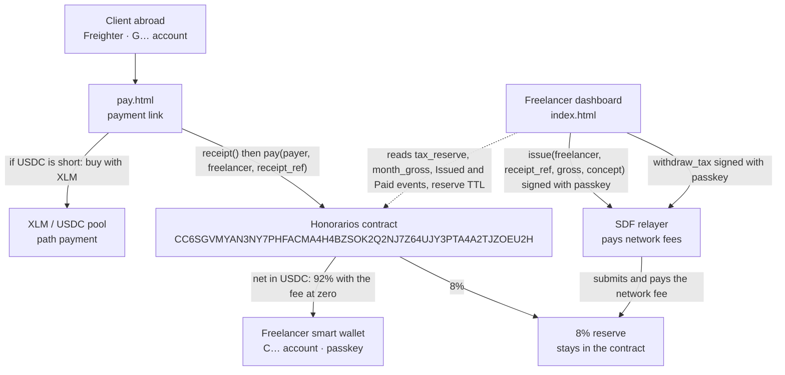
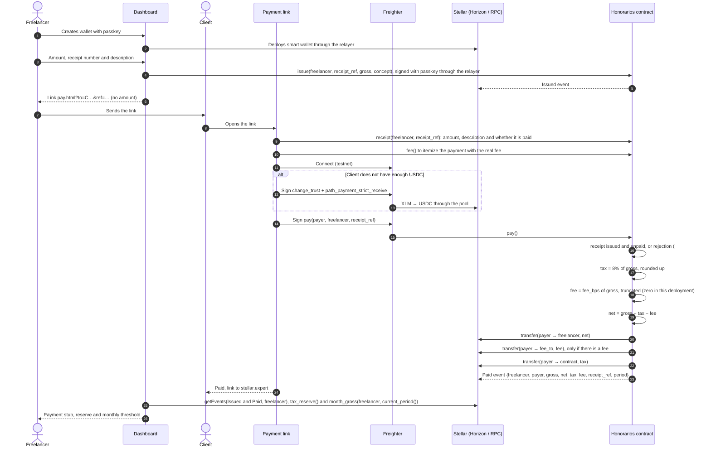
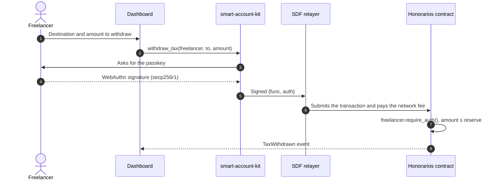

# Honorarios · Architecture and flow

Last reviewed: September 24, 2026.

Honorarios lets a Peruvian freelancer get paid by clients abroad in USDC on Stellar. The freelancer signs each receipt and records it in a Soroban contract; the client can only pay that receipt, once, for the recorded amount. The contract splits each payment on the spot: 92% to the freelancer and 8% into a reserve in their name for the fourth-category income tax prepayment owed to SUNAT, Peru's tax authority. Only the freelancer can withdraw that reserve.

## 1. Components

## 2. Payment flow

## 3. Reserve withdrawal

## 4. What lives on chain and what does not

| On chain (Soroban) | Off chain (browser) |
|---|---|
| Issued receipts, with amount, description and status (`Receipt(Address, String)`) | Payment link: only the destination, receipt number and display name |
| Split of the gross and USDC transfers | Draft of SUNAT's recibo por honorarios, the electronic fee receipt |
| Per-freelancer reserve (`TaxReserve(Address)`) | Exchange rate entered by the freelancer |
| Gross collected in the month (`MonthGross(Address, u32)`) | Comparison against the threshold and prepayment estimate |
| `Issued`, `Paid` and `TaxWithdrawn` events | Fourth-category income outside the app, fifth-category (employment) income and withholdings |
| Withdrawal authorization (`require_auth`) | Passkey session (IndexedDB) |

The contract stores no amounts in soles and no exchange rates. It carries only two things from tax law: the 8% rate of the fourth-category prepayment, and the month closing at midnight Lima time, which is the month SUNAT measures. The thresholds live in `web/src/tax.ts` and are compared in the dashboard using the exchange rate the freelancer declares.

The monthly thresholds are the ones in article 3 of R.S. 000390-2025/SUNAT: S/ 4,010 in the general regime and S/ 3,208 for income under article 33 clause b) of the LIR (Peru's income tax law), that is, director, síndico (bankruptcy trustee), mandatario (agent under a mandate), gestor de negocios (business manager), albacea (executor) and regidor (municipal councillor). The dashboard asks about that case and compares against the matching threshold. The same resolution sets the annual caps for requesting a suspension, S/ 48,125 and S/ 38,500.

## 5. Contract

| Function | Authorized by | Effect |
|---|---|---|
| `__constructor(token, fee_bps, fee_to)` | deployment | Sets the USDC SAC, the service fee and the wallet that receives it. Rejects a fee above 1% |
| `issue(freelancer, receipt_ref, gross, concept)` | `freelancer` | Records the receipt. A number can be issued only once. Emits `Issued` |
| `receipt(freelancer, receipt_ref)` | read only | Amount, description and whether it has been paid |
| `pay(payer, freelancer, receipt_ref)` | `payer` | Charges the receipt amount: net to the freelancer, fee to `fee_to` if there is one, 8% to the contract. Marks the receipt paid, adds to the monthly total and emits `Paid`. Returns the net |
| `fee()` | read only | Fee in basis points and the wallet that receives it |
| `token()` | read only | Address of the SAC used for payment |
| `tax_reserve(freelancer)` | read only | Reserved balance |
| `month_gross(freelancer, period)` | read only | Gross collected in that tax period |
| `current_period()` | read only | Tax period of the current ledger, in Lima time |
| `extend_reserve(freelancer)` | nobody (anyone can call it) | Renews the TTL of an idle reserve without moving funds. The dashboard offers it when 10 days or fewer are left |
| `withdraw_tax(freelancer, to, amount)` | `freelancer` | Moves the reserve, emits `TaxWithdrawn` |

Errors: `InvalidAmount` (amount ≤ 0, or a gross so large that the 8% would overflow), `InsufficientReserve` (withdrawal larger than the reserve), `InvalidParty` (the freelancer is the payer or the contract itself), `ReceiptRefTooLong` (receipt number longer than 32 characters), `FeeTooHigh` (negative fee or above the 1% cap, which can only trigger at deployment), `ReceiptExists` (number already issued), `UnknownReceipt` (nobody issued that number), `AlreadyPaid`, `ConceptTooLong` (more than 80 bytes) and `EmptyReceiptRef`. The reserve, the receipt, the monthly total and the instance renew their TTL to about 30 days on every operation that touches them. The monthly total (`MonthGross`) is what gets compared against SUNAT's threshold, and it lives in the contract so the dashboard does not depend on how many events the RPC keeps. Since only the freelancer issues receipts, no outsider can add payments to their month. Covered by 31 tests in `contracts/split/src/test.rs`, five of them authorization tests with the environment in strict mode (`set_auths(&[])`, no signature granted).

## 6. Testnet evidence

Current contract: [CC6SGVMYAN3NY7PHFACMA4H4BZSOK2Q2NJ7Z64UJY3PTA4A2TJZOEU2H](https://stellar.expert/explorer/testnet/contract/CC6SGVMYAN3NY7PHFACMA4H4BZSOK2Q2NJ7Z64UJY3PTA4A2TJZOEU2H). The hashes of the valid flow and of the five rejected attacks are in the README and in [`evidence/2026-09-24-contract/source.md`](../evidence/2026-09-24-contract/source.md).

## Known limits

- `smart-account-kit` and the relayer have no independent audit (their own READMEs say so). Testnet use only.
- We did not find a SUNAT rule specific to fees paid in crypto. The exchange rate is set by the freelancer; the app does not fix it.
- The reserve is an organizing aid and does not replace an accountant.
